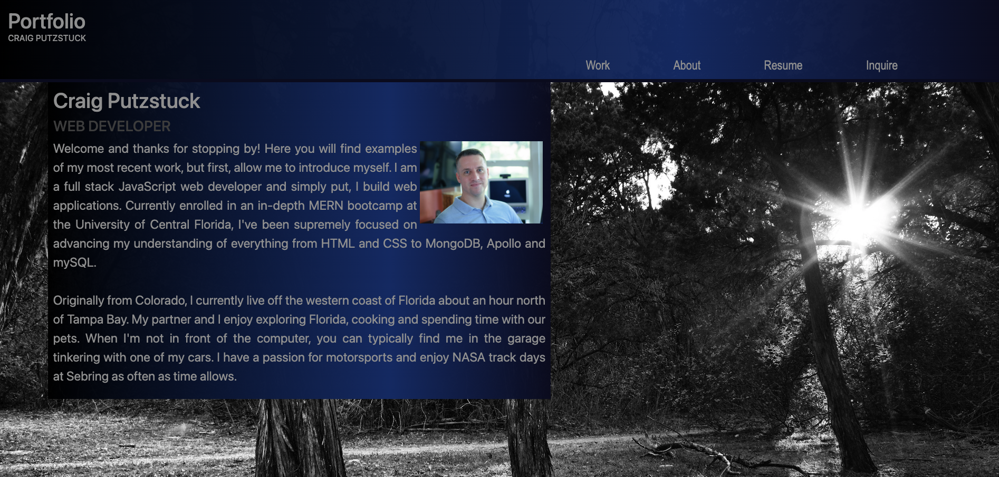

# CRAIG PUTZSTUCK PROFESSIONAL REACT PORTFOLIO

## Description

Single page portfolio built on React showcasing recent projects, about me information and a contact form to get in touch.

- Utilizing modern technologies, the motivation behind this project was to create an effective portfolio that showased recent applications while demonstrating React abilities in and of itself.
- This portfolio helps to stand out from the crowd based off its architecture.
- This project was a great exercise in learning how to pass variables, functions and files around to create a simple, robust application.

## Table of Contents

- [Installation](#installation)
- [Usage](#usage)
- [Credits](#credits)
- [License](#license)

## Installation

Simply copy the url and paste it in your favorite browser.

## Usage

Open your favorite browser and navigate to the applications location.

## Credits

N/A

## License

MIT License

## Questions

- Email: putzstuck@gmail.com
- GitHub Profile: https://github.com/argounova